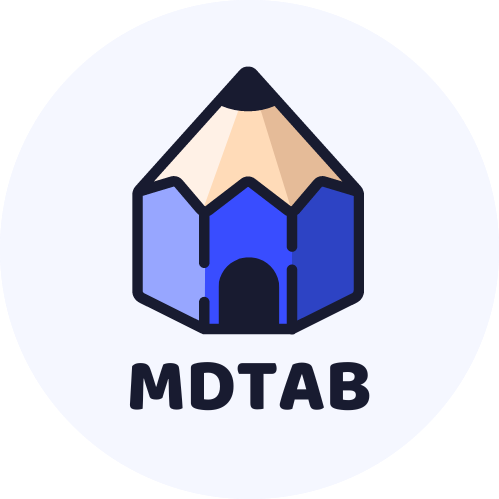
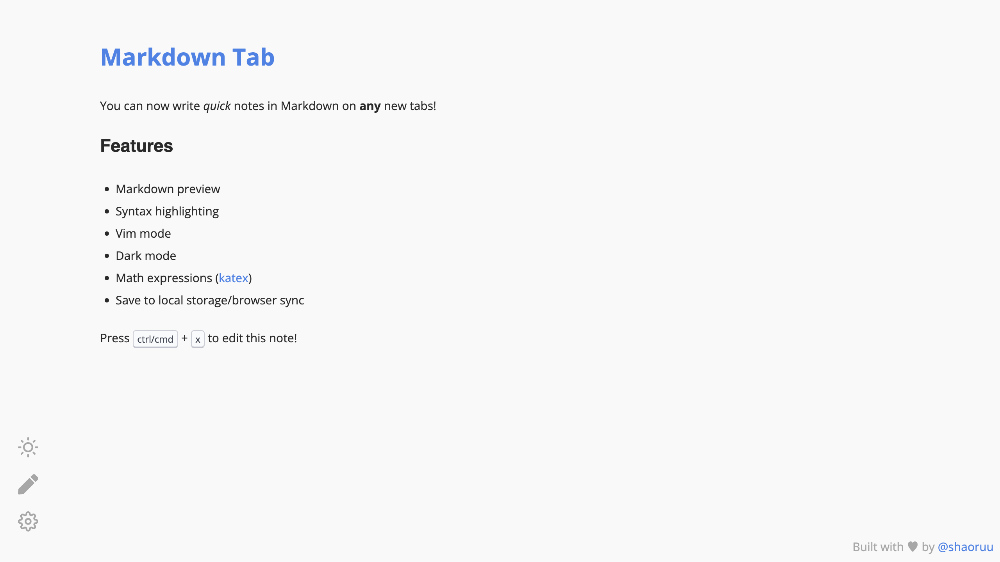
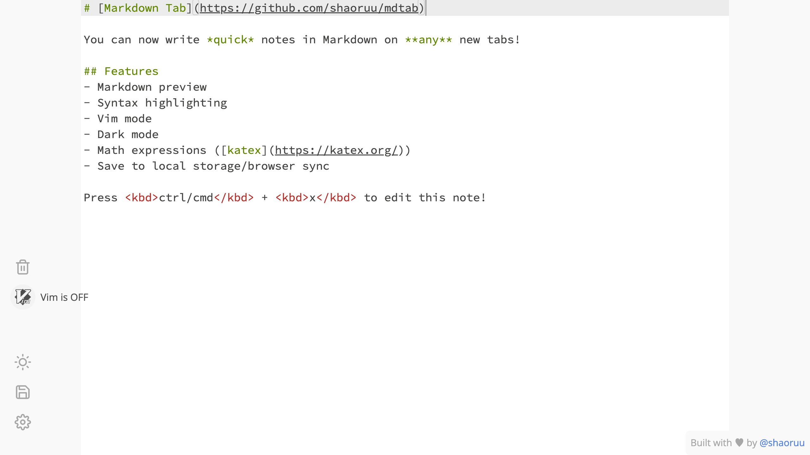
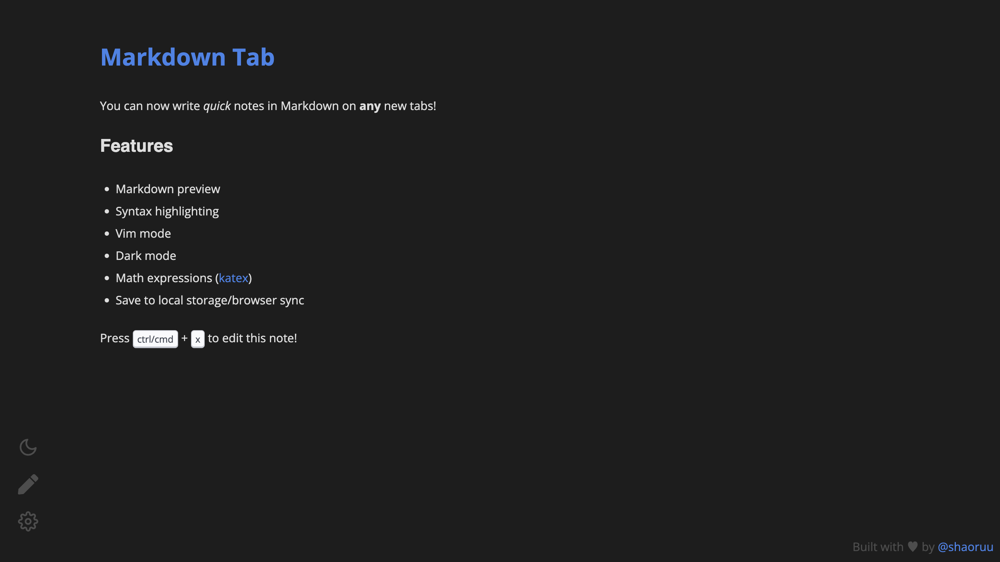

<a href="https://mdtab.shaoruu.io">
  

    
  

  <h1 align="center">MDTab</h1>
</a>

Write quick notes in Markdown on any new tabs!

## Installation

Right now MDTab has only been tested on Chrome (brave browser). You can install it from the [Chrome Web Store](https://chrome.google.com/webstore/detail/mdtab/bincngeefkdehfpilfnfgjmigfmgfgfh?hl=en&authuser=0).

## Features

- Markdown preview
- Syntax highlighting
- Vim mode
- Dark mode
- Math expressions (katex)
- Save to local storage/browser sync

## Preview

  
  
  

## Upcoming Features

- Multi-note support (like Apple Notes)
- Firefox/more browser support
- More themes!!

Any pull requests or bug reports are welcome!

## Donate

This is a passionate project that I created in my free time. If you like it, please consider donating to support the project! I'm a student and I'm trying to make this project as good as possible. Any amount is appreciated!

  
  
  

## License

Copyright © Ian Huang. All rights reserved.

Licensed under the [MIT](LICENSE) License.
